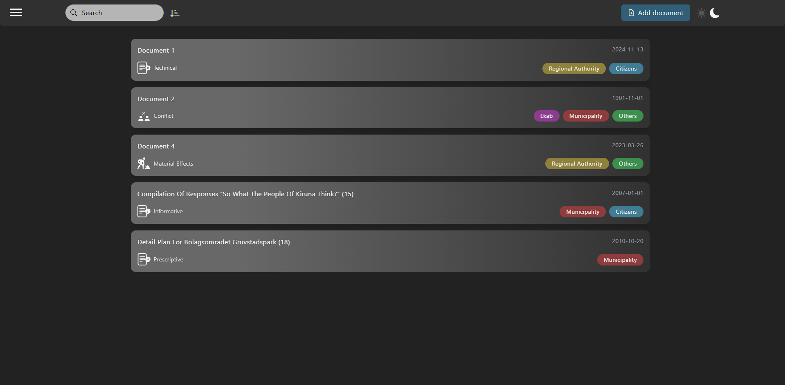
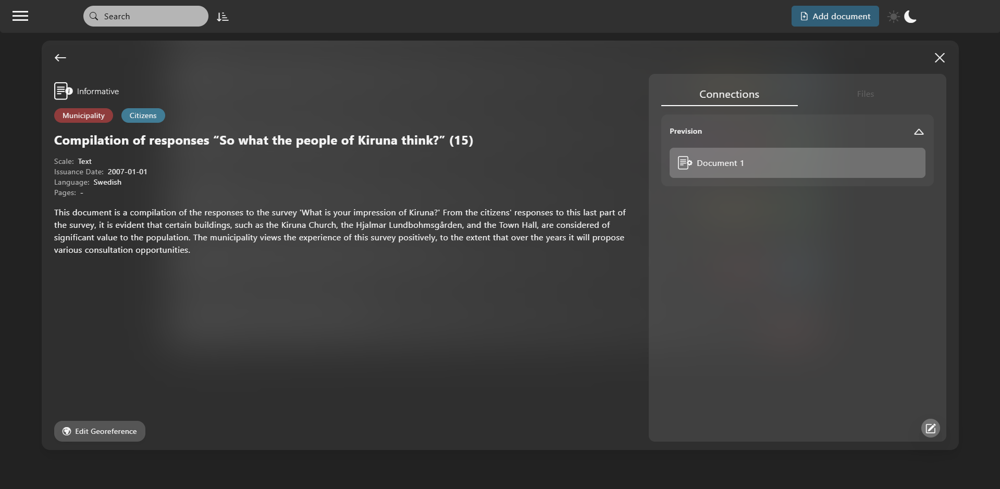
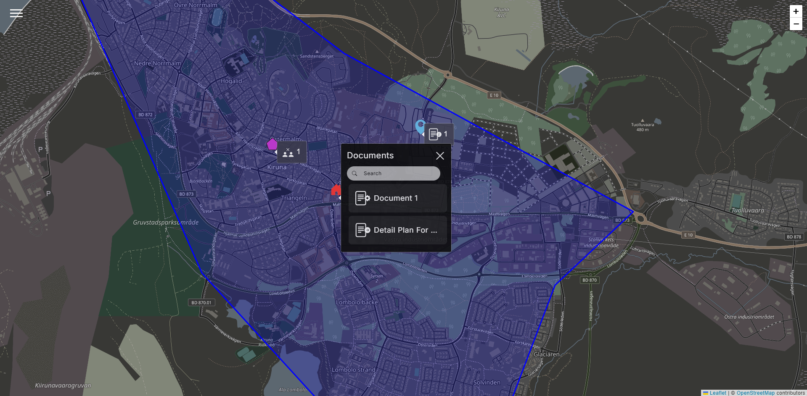

# Kiruna Explorer

## Table of Contents

1. [Introduction](#introduction)
2. [Technologies Used](#technologies-used)
3. [Database Structure](#database-structure)
4. [API Documentation](#api-documentation)
5. [User Credentials](#user-credentials)
6. [Dockerization](#dockerization)
7. [Screenshots](#screenshots)
8. [License](#license)

## Introduction

## Technologies Used

- **Frontend**: React.js
- **Backend**: Express.js
- **Database**: sqlite3

## Database Structure

1. ["users" Table](#users-table)
2. ["document" Table](#document-table)
3. ["area" Table](#area-table)
4. ["document_link" Table](#document_link-table)
5. ["attachment" Table](#attachment-table)
6. ["file" Table](#file-table)
7. ["stakeholder" Table](#stakeholder-table)
8. ["document_type" Table](#document_type-table)
9. ["document_stakeholder" Table](#document_stakeholder-table)
10. [Tables Relationships](#tables-relationships)

### **"users" Table**

Stores information about system users, including their roles and authentication details.

| Column           | Type      | Description                                                 |
| ---------------- | --------- | ----------------------------------------------------------- |
| **`id`**         | _Integer_ | **Primary Key** - Unique identifier for each user.          |
| **`role`**       | _Text_    | User role, restricted to `"urban_planner"` or `"resident"`. |
| **`username`**   | _Text_    | Unique username for authentication.                         |
| **`password`**   | _Text_    | Hashed password for secure authentication.                  |
| **`salt`**       | _Text_    | Salt value for password hashing.                            |
| **`avatar_url`** | _Text_    | URL of the user's avatar image.                             |

#### **Possible Values**
- **`role`**: `urban_planner`, `resident`

---

### **"document" Table**

Captures details about various documents, including their type, issuance date, and related geographical area.

| Column            | Type      | Description                                                              |
| ----------------- | --------- | ------------------------------------------------------------------------ |
| **`id`**          | _Integer_ | **Primary Key** - Unique identifier for each document.                   |
| **`title`**       | _Text_    | Title of the document.                                                   |
| **`date`**        | _Text_    | Date of issuance (formatted as `YYYY-MM-DD`).                            |
| **`typeId`**      | _Integer_ | **Foreign Key** - Links to the `id` column in the `document_type` table. |
| **`language`**    | _Text_    | Language in which the document is written.                               |
| **`description`** | _Text_    | Brief description or summary of the document.                            |
| **`scale`**       | _Text_    | Scale of the document.                                                   |
| **`areaId`**      | _Integer_ | **Foreign Key** - Links to the `id` column in the `area` table.          |
| **`pages`**       | _Integer_ | Total number of pages in the document.                                   |
| **`planNumber`**  | _Integer_ | Plan number associated with the document.                                |

---

### **"area" Table**

Defines geographical areas using GeoJSON coordinates.

| Column        | Type        | Description                                                     |
| ------------- | ----------- | --------------------------------------------------------------- |
| **`id`**      | _Integer_   | **Primary Key** - Unique identifier for each geographical area. |
| **`geoJson`** | _Text/JSON_ | GeoJSON object specifying coordinates of the area.              |

---

### **"document_link" Table**

Represents relationships or dependencies between two documents.

| Column           | Type      | Description                                                           |
| ---------------- | --------- | --------------------------------------------------------------------- |
| **`id`**         | _Integer_ | **Primary Key** - Unique identifier for each document link.           |
| **`doc1Id`**     | _Integer_ | **Foreign Key** - References the `id` column in the `document` table. |
| **`doc2Id`**     | _Integer_ | **Foreign Key** - References the `id` column in the `document` table. |
| **`date`**       | _Text_    | Date of the link creation (formatted as `YYYY-MM-DD`).                |
| **`connection`** | _Text_    | Type of connection between documents.                                 |

#### **Possible Values**
- **`connection`**: `direct_consequence`, `collateral_consequence`, `prevision`, `update`

---

### **"attachment" Table**

Represents the association between documents and their files.

| Column       | Type      | Description                                                           |
| ------------ | --------- | --------------------------------------------------------------------- |
| **`id`**     | _Integer_ | **Primary Key** - Unique identifier for each attachment.              |
| **`docId`**  | _Integer_ | **Foreign Key** - References the `id` column in the `document` table. |
| **`fileId`** | _Integer_ | **Foreign Key** - References the `id` column in the `file` table.     |

---

### **"file" Table**

Stores information about files associated with documents.

| Column     | Type      | Description                                        |
| ---------- | --------- | -------------------------------------------------- |
| **`id`**   | _Integer_ | **Primary Key** - Unique identifier for each file. |
| **`name`** | _Text_    | Name of the file.                                  |
| **`type`** | _Text_    | File type.                                         |
| **`path`** | _Text_    | Path to the file.                                  |

#### **Possible Values**
- **`type`**: `original_document`, `attachment`

---

### **"stakeholder" Table**

Stores information about stakeholders related to documents.

| Column    | Type      | Description                                   |
| --------- | --------- | --------------------------------------------- |
| **`id`**  | _Integer_ | **Primary Key** - Unique identifier for each stakeholder. |
| **`name`**| _Text_    | Name of the stakeholder.                      |

---

### **"document_stakeholder" Table**

Represents relationships between documents and stakeholders.

| Column        | Type      | Description                                                           |
| ------------- | --------- | --------------------------------------------------------------------- |
| **`documentId`**  | _Integer_ | **Foreign Key** - References the `id` column in the `document` table. |
| **`stakeholderId`** | _Integer_ | **Foreign Key** - References the `id` column in the `stakeholder` table. |

This table defines the connection between a specific document and the stakeholders associated with it.

---

### **"document_type" Table**

Defines different types of documents in the system.

| Column     | Type      | Description                                |
| ---------- | --------- | ------------------------------------------ |
| **`id`**   | _Integer_ | **Primary Key** - Unique identifier for each document type. |
| **`name`** | _Text_    | Name of the document type.                |

---

### **Tables Relationships**

1. **Users**:
   - The `users` table is standalone and used for authentication and authorization.

2. **Documents and Areas**:
   - Each document in the `document` table is linked to a geographical area through the `areaId` foreign key, referencing the `area` table.

3. **Document Relationships**:
   - The `document_link` table allows associating two documents and categorizing their relationship.

4. **Attachments**:
   - The `attachment` table connects documents with files stored in the `file` table.

5. **Stakeholders**:
   - The `document_stakeholder` table establishes a relationship between documents and stakeholders.

6. **Document Types**:
   - The `document_type` table categorizes documents based on their type.

## API Documentation

1. [Add Document](#add-document)
2. [Get All Documents](#get-all-documents)
3. [Get Document by ID](#get-document-by-id)
4. [Get Documents by Area ID](#get-documents-by-area-id)
5. [Link Document](#link-document)
6. [Add Links to a Document](#add-links-to-a-document)
7. [Get Linked Documents](#get-linked-documents)
8. [Delete Links](#delete-links)
9. [Get All Areas](#get-all-areas)
10. [Add Area](#add-area)
11. [Edit Area ID](#edit-area-id)
12. [Add Files](#add-files)
13. [Delete File](#delete-file)
14. [Get Files](#get-files)
15. [Download a File](#download-a-file)
16. [Get Attachments](#get-attachments)

### **Add Document**

**POST** `api/documents`

Description : Adds a new document

Request body :

- body with all fields:

  ```
  {
    "title": "string",
    "scale": "plan",
    "date": "2022-01-01",
    "language": "string",
    "type": "design",
    "pages": 1,
    "description": "string",
    "links":
      [
        {
          "selectedDocId" : 1,
          "date" : "2022-01-01",
          "connectionType" : "direct_consequence"
        }
      ],
    "areaId": 1,
    "stakeholders": [
      "lkab",
      "municipality"
    ],
    "planNumber": 2
  }
  ```

- body without nullable fields
  `  {
  "title": "string",
  "scale": "plan",
  "date": "string",
  "type": "design",
  "description": "string",
  "stakeholders": [
    "string",
    "string"
  ],
  "planNumber": 2,
}`
  Response:
- `201 Created`;
- `400 Bad Request` (a field has invalid value)
- `400 Not Found` (area not found)
- `500 Internal Server Error`

Response body:

```
{
  "lastId": 1,
  "message": "Document added successfully"
}
```

If not already present area, first he has to create one

---

### **Get All Documents**

**GET** `api/documents`

Description : Get all documents

Request body : none

Response :

- `200 OK`
- `500 Internal Server Error`

Response body:

```
  [
    {
      "id": 1,
      "title": "title",
      "stakeholders": [
        "municipality",
        "architecture firms"
      ],
      "date": "2004-02-01",
      "type": "conflict",
      "language": "ar",
      "description": "hello",
      "areaId": 1,
      "scale": "concept",
      "pages": 102940,
      "planNumber": ""
    },
    {
      "id": 2,
      "title": "title",
      "stakeholders": [
        "municipality",
        "architecture firms"
      ],
      "date": "2004-02-01",
      "type": "conflict",
      "language": "ar",
      "description": "hello",
      "areaId": 1,
      "scale": "concept",
      "pages": 102940,
      "planNumber": ""
    }
  ]
```

---

### **Get Document by ID**

**GET** `api/documents/:DocId`

Description : Retrieve information of a docuemnt given its `<DocId>`

Reuest parameters: Document Id

Response :

- `200 OK`
- `500 Internal Server Error`
- `400 Bad Request` (Document id not valid number)

Response body:

```
{
  "id": 1,
  "title": "string",
  "stakeholders": [
    "municipality"
  ],
  "date": "string",
  "type": "design",
  "language": null,
  "description": "string",
  "areaId": null,
  "scale": "plan",
  "pages": null,
  "planNumber": 2
}
```

---

### **Get Documents by Area ID**

**GET** `api/documents/area/:areaId`

Description : Retrieve all documents belonging toa certain area given its `<areaId>`

Reuest parameters: Area Id

Response :

- `200 OK`
- `500 Internal Server Error`
- `400 Bad Request` (Area id not valid number)
- `404 Not Found` (Area not found)
- `404 Not Found` (No documents found for this area)

Response body:

```
{
  "id": 1,
  "title": "string",
  "stakeholders": [
    "municipality"
  ],
  "date": "string",
  "type": "design",
  "language": null,
  "description": "string",
  "areaId": 1,
  "scale": "plan",
  "pages": null,
  "planNumber": 2
}
```

---

### **Link Document**:

**POST** `api/documents/link`

Description : Link two documents

Request Body:

```
{
  "doc1Id": 1,
  "doc2Id": 2,
  "connection": "update",
  "date": "2023-01-01"
}
```

Response :

- `200 OK`
- `500 Internal Server Error`
- `400 Bad Request` (FIelds not valid)
- `402 Bad Request` (Invalid connection type)
- `403 Bad Request` (Link already exists)
- `404 Not Found` (Document not found)

Response body: None

---

### **Add links to a document**

**POST** `api/documents/links`

Description : Add links to a document, receiving an array of links

Request Body:

```
[
  {
    "originalDocId" : 1,
    "selectedDocId" : 2,
    "connectionType" : "direct_consequence",
    "date" : "2023-01-01"
  },
  {
    "originalDocId" : 3,
    "selectedDocId" : 4,
    "connectionType" : "prevision",
    "date" : "2023-01-02"
  }
]
```

Response :

- `200 OK`
- `500 Internal Server Error`
- `400 Bad Request` (Array is empty)
- `402 Bad Request` (Invalid connection type)
- `404 Not Found` (Document not found)

---

### **Get Linked Documents**

**GET** `api/documents/:DocId/links`

Description : Get all linked documents to a ceratin document with its <DocId>

Requqest parameters: Document Id

Response :

- `200 OK`
- `500 Internal Server Error`
- `400 Bad Request` (Document id not valid number)

Response body:

```
[
  {
    "id": 1,
    "title": "string",
    "trype": "design",
    "connection": "update"
  },
  {
    "id": 2,
    "title": "string",
    "trype": "design",
    "connection": "update"
  }
]
```

---

### **Delete links**

**DELETE** `api/documents/:DocId/links`

Description : Delete all links associated to a document with its <DocId>

Requqest parameters: Document Id

Response :

- `200 OK`
- `500 Internal Server Error`

Response body: None

---

### **Get All Areas**

**GET** `api/areas`

Description : Retrieve all areas

Response :

- `200 OK`
- `500 Internal Server Error`
- `404 Not Found` (Area not found)

Response body:

```
[
  {
    "id": 1,
    "geojson" : {
      ...
    }
  },
  {
    "id": 2,
    "geojson" : {
      ..-
    }
  }
]
```

---

### **Add Area**:

**POST** `api/areas`

Description : Adds a new area drawn by the user or representing a single point on the map

Request Body:

```
{
  "geojson" : {
    ...
  }
}
```

Response :

- `201 Created`
- `500 Internal Server Error`
- `400 Bad Request` (FIelds not valid)
- `404 Not Found` (Document not found)

Response body: None

---

### **Edit Area ID**:

**PUT** `api/documents/:DocId/area`

Description : Modify the area id assinged to a document, deletes the previous one if not assigned to a document anymore

Requqest parameters: Document Id

Request Body:

```
{
  "areaID" : 1
}
```

Response :

- `200 OK`
- `500 Internal Server Error`
- `400 Bad Request` (Document id not valid)
- `404 Not Found` (Area not found)

Response body: None

---

### **Add Files**:

**POST** `api/documents/:DocId/uploads`

Description : Add resources to a certain docuemnt identified by its <DocId>

Requqest parameters: Document Id

Request Body:

```
[
  {
    "name" : "name",
    "type" : "original",
    "path" : "path/to/file"
  },
  {
    "name" : "name2",
    "type" : "Attachment",
    "path" : "path/to/file2"
  }
]
```

Response :

- `200 OK`
- `500 Internal Server Error`
- `400 Bad Request` (Document id not valid)
- `404 Not Found` (Document not found)

Response body: None

---

### **Delete File**

**DELETE** `api/documents/:DocId/files/:FileId`

Description : Delete a specific file stored in the server with a certain <FileId>, associated to a document with its <DocId>

Requqest parameters: Document Id, File Id

Response :

- `200 OK`
- `404 Not Found`
- `500 Internal Server Error`

Response body: None

---

### **Get Files**

**GET** `api/documents/:DocId/files`

Description : Get all attachments associated to a document with its <DocId>

Requqest parameters: Document Id

Response :

- `200 OK`
- `404 Not Found`
- `500 Internal Server Error`

Response body:

```
[
  {
    "id": 1,
    "name": "file_name",
    "type": "original",
    "path": "/files/hashed_file_name"
  },
  {
    "id": 2,
    "name": "file_name2",
    "type": "original",
    "path": "/files/hashed_file_name2"
  }
]
```

---

### **Download a File**

**GET** `api/documents/:DocId/files/download/:FileId`

Description : Download a specific file stored in the server with a certain <FileId>, associated to a document with its <DocId>

Requqest parameters: Document Id, File Id

Response :

- `200 OK`
- `404 Not Found`
- `500 Internal Server Error`

Response body: None

### **Get Attachments**

**GET** `api/documents/:DocId/attachments`

Description : Get all attachments associated to a document with its <DocId>

Requqest parameters: Document Id

Response :

- `200 OK`
- `404 Not Found`
- `500 Internal Server Error`

Response body:

```
[
  {
    'name' : 'name',
    'trype' : 'map',
    'path' : 'path/to/file'
  },
  {
    'name' : 'name2',
    'trype' : 'text',
    'path' : 'path/to/file2'
  }
]
```

## Users Credentials

| username | Password | Role          |
| -------- | -------- | ------------- |
| Romeo    | 1111     | urban planner |
| Juliet   | 2222     | resident      |

## Dockerization

The application is dockerized and can be run using the following command inside the root folder of the project `02-kiruna-explorer/`:

```bash
$docker compose build
$docker compose up
```

**note**: You need to have Docker Desktop installed and opened in background

## SCREENSHOTS


_List of all documents_


_Visualization of a document_


_Map_

## LICENSE

[![CC BY-NC 4.0][cc-by-nc-shield]][cc-by-nc]

[cc-by-nc]: https://creativecommons.org/licenses/by-nc/4.0/
[cc-by-nc-shield]: https://img.shields.io/badge/License-CC%20BY--NC%204.0-lightgrey.svg
